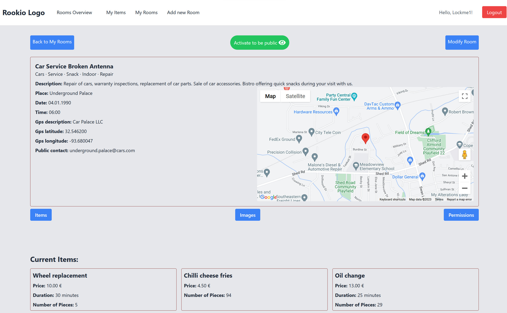

# Rookio-light

## Introduction

This project was created for the final part of the Python from Scratch course, facilitated by the Software Development Academy. 

Rookio-light project is about creating Events/Services by regular people w/wo a business for other users.
It allows an unauthenticated user to search for available rooms in the list and participate in events or use the services offered by the room, under a unique nickname.
A logged-in user has the possibility to create a custom room and add his own custom items to it.

The project is used for purely personal educational purposes.

## Screenshots 

## Technologies Used

### Django Framework

Django is a high-level Python Web framework that encourages rapid development and clean, pragmatic design. It follows the model-template-view architectural pattern and is maintained by the Django Software Foundation.

- [Official Website](https://www.djangoproject.com/)
- [Documentation](https://docs.djangoproject.com/)

### Tailwind CSS

Tailwind CSS is a utility-first CSS framework for rapidly building custom designs. It allows for efficient and quick styling without leaving the HTML.

- [Official Website](https://tailwindcss.com/)
- [Documentation](https://tailwindcss.com/docs)

### Google Maps API

#### Maps Javascript API

This API lets you customize maps with your own content and imagery for display on web pages and mobile devices. It provides features like markers, polygons, and overlays to create interactive maps tailored to your needs.

- [Official Documentation](https://developers.google.com/maps/documentation/javascript/overview)

#### Geocoding API

The Geocoding API is a service that provides geocoding and reverse geocoding of addresses. This means you can turn addresses into geographic coordinates (and vice versa).

- [Official Documentation](https://developers.google.com/maps/documentation/geocoding/overview)